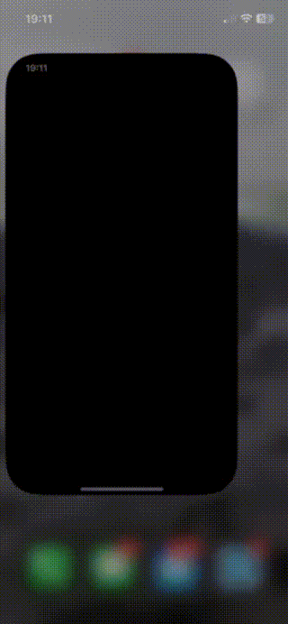

# Push Notifications iOS Sample
This repository contains a basic implementation that receives Push notifications. 

This repository serves as the foundational code for the accompanying blog post. [Unlocking Firebase iOS Push Notifications](https://javios.eu/swift/harnessing-nfc-technology-in-your-ios-app/) 

## 🎥 Demo Video

### Check out the app in action!  
  

## Requirements

- **Xcode 15.0 or later**
- **iOS 16.0 or later**
- **Swift 6.0**

